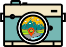

<!-- PROJECT LOGO -->
 

  

  <h1 align="center">Snapsmaps</h1>

  

    Easily share photos with a map pin to friends and family.
     
     
    
    
    
    
     
     
    <a href="https://snapsmaps.com">Live Demo</a>
    ·
    <a href="https://github.com/ShaneIsrael/Snapsmaps/issues">Report a Bug</a>
    ·
    <a href="https://www.paypal.com/paypalme/shaneisrael">Buy me a Coffee! / Donate</a>
  

<!-- TABLE OF CONTENTS -->

  
Table of Contents

  <ol>
    <li>
      <a href="#about-the-project">About The Project</a>
    </li>
  </ol>

<!-- ABOUT THE PROJECT -->

# About The Project

In 2024 I had a trip planned to go to Japan. I am not on most social medias where many of my family members are so I wanted an easy way to share photos with them combined with the gps location of where I was currently at when I took that photo. I thought it could be a cool way for them to follow me along on my trip. So I spent 3 months building Snapsmaps. I then went on my trip in August for a grand total of 22 days. I always planned to make it self-hostable and open source for everyone and I finally got around to doing that.

# Contributing

If this project is at all interesting to you please feel free to contribute or create suggestions if you have them. Please note that creating a pull request does not guarantee it will be accepted into the project. Outside of obvious bug fixes it may be best to consult with us before starting work on any additions you'd like to make.

[For questions or feature requests please create an issue with an appropriate label here](https://github.com/ShaneIsrael/Snapsmaps/issues/new)
